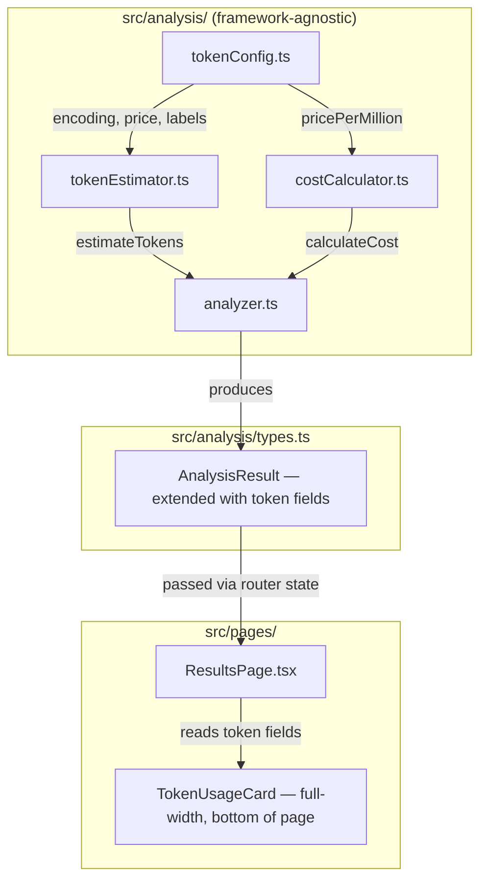
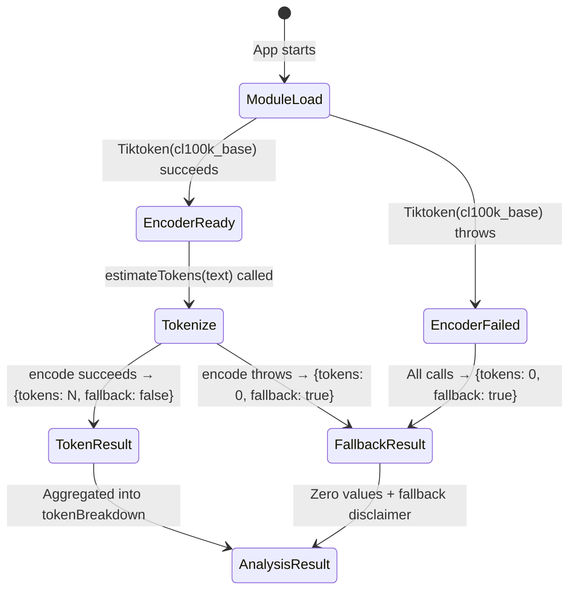

# Design Document: Estimated Token Usage

## Overview

This feature adds client-side token counting and cost estimation to AskBetter's analysis pipeline. When a user analyzes a conversation, the system tokenizes each prompt using `js-tiktoken` with the `cl100k_base` encoding, computes per-prompt and total token counts, and derives an estimated input cost in USD. The results are surfaced on the Results page in a new Token Usage Card.

### Design Goals

1. **Deterministic Estimation**: Same input text always produces the same token count — no network calls, no randomness.
2. **Graceful Degradation**: If the tokenizer fails to load (e.g., WASM issue, bundle error), the analysis pipeline continues unaffected — token fields default to zero with a fallback disclaimer.
3. **Separation of Concerns**: Token estimation and cost calculation live in `src/analysis/` as framework-agnostic utilities. The UI layer only reads pre-computed fields from `AnalysisResult`.
4. **Minimal Footprint**: Use `js-tiktoken/lite` with a static rank import to keep the bundle small. No CDN fetches at runtime.
5. **Display-Layer Rounding**: All cost arithmetic uses full floating-point precision internally. Rounding to six decimal places happens only when rendering USD in the UI.

### Key Design Decisions

- **`js-tiktoken/lite` with static rank import**: Avoids loading all encodings. We import `cl100k_base` ranks directly, keeping the bundle lean and avoiding runtime network requests.
- **Singleton encoder**: The `Tiktoken` instance is created once at module load time and reused across all calls. If construction throws, a module-level flag records the failure.
- **No async in the hot path**: Encoder initialization is synchronous (static import of rank data). `estimateTokens()` is a pure synchronous function.
- **Cost formula in a pure function**: `calculateCost(tokens, pricePerMillion)` is a one-liner with no side effects, making it trivially testable.
- **Central config object**: Encoding name, price rate, labels, and disclaimers live in a single `TOKEN_CONFIG` constant so they can be updated in one place.

## Architecture

### System Components



### Data Flow

1. User pastes a conversation and clicks Analyze.
2. `InputPage` calls `parseConversation()` → `analyzeConversation()`.
3. Inside `analyzeConversation()`:
   - Each prompt string is passed to `estimateTokens(text)` → returns `{ tokens: number, fallback: boolean }`.
   - Per-prompt costs are computed via `calculateCost(tokens, TOKEN_CONFIG.pricePerMillion)`.
   - Totals are summed. Label and disclaimer are pulled from `TOKEN_CONFIG` (or the fallback disclaimer if any prompt triggered `fallback: true`).
4. The enriched `AnalysisResult` (with `tokenBreakdown`, `totalPromptTokens`, `estimatedPromptCostUsd`, `tokenEstimateLabel`, `tokenEstimateDisclaimer`) is passed to `ResultsPage` via `location.state`.
5. `ResultsPage` renders the `TokenUsageCard` as a full-width card at the bottom of the page, below the Feedback & Recommendations card.

### Module Dependency Graph

```
tokenConfig.ts          (constants only — no imports from project)
    ↓
tokenEstimator.ts       (imports js-tiktoken/lite + cl100k_base ranks + tokenConfig)
    ↓
costCalculator.ts       (pure function, imports nothing from project)
    ↓
analyzer.ts             (imports tokenEstimator, costCalculator, tokenConfig)
    ↓
types.ts                (extended AnalysisResult interface)
    ↓
ResultsPage.tsx         (reads AnalysisResult, renders TokenUsageCard)
```

## Components and Interfaces

### tokenConfig.ts

**Location**: `askbetter/src/analysis/tokenConfig.ts`

```typescript
export const TOKEN_CONFIG = {
  /** Encoding used by js-tiktoken */
  encoding: 'cl100k_base',

  /** Price per 1 million input tokens in USD (GPT-4o rate) */
  pricePerMillion: 2.50,

  /** Display label shown on the Token Usage Card */
  label: 'Estimated using cl100k_base encoding',

  /** Standard disclaimer */
  disclaimer:
    'Estimates are based on pasted user messages only and may differ from provider-billed tokens.',

  /** Fallback disclaimer when tokenizer fails to load */
  fallbackDisclaimer:
    'Token estimation was unavailable for this analysis. Counts shown as zero.',
} as const;
```

### tokenEstimator.ts

**Location**: `askbetter/src/analysis/tokenEstimator.ts`

```typescript
import { Tiktoken } from 'js-tiktoken/lite';
import cl100k_base from 'js-tiktoken/ranks/cl100k_base';

interface TokenEstimate {
  tokens: number;
  fallback: boolean;
}

let encoder: Tiktoken | null = null;
let initFailed = false;

try {
  encoder = new Tiktoken(cl100k_base);
} catch {
  initFailed = true;
}

export function estimateTokens(text: string): TokenEstimate {
  if (initFailed || !encoder) {
    return { tokens: 0, fallback: true };
  }
  if (text.length === 0) {
    return { tokens: 0, fallback: false };
  }
  try {
    const tokenIds = encoder.encode(text);
    return { tokens: tokenIds.length, fallback: false };
  } catch {
    return { tokens: 0, fallback: true };
  }
}

export function isTokenizerAvailable(): boolean {
  return !initFailed && encoder !== null;
}
```

**Key behaviors**:
- Encoder is constructed once at module load. If it throws, `initFailed` is set and all subsequent calls return `{ tokens: 0, fallback: true }`.
- Empty string input returns `{ tokens: 0, fallback: false }` (not a failure — just no tokens).
- Any runtime encoding error also triggers fallback for that call.

### costCalculator.ts

**Location**: `askbetter/src/analysis/costCalculator.ts`

```typescript
export function calculateCost(tokens: number, pricePerMillion: number): number {
  if (tokens <= 0 || pricePerMillion <= 0) {
    return 0;
  }
  return (tokens / 1_000_000) * pricePerMillion;
}
```

Pure function. No rounding — full floating-point precision returned.

### types.ts — Extended Fields

**Location**: `askbetter/src/analysis/types.ts` (additions to existing file)

```typescript
// Added to existing types.ts

export interface TokenBreakdownEntry {
  index: number;
  tokens: number;
  costUsd: number;
}

// Existing AnalysisResult interface extended with:
export interface AnalysisResult {
  // ... existing fields ...
  tokenBreakdown: TokenBreakdownEntry[];
  totalPromptTokens: number;
  estimatedPromptCostUsd: number;
  tokenEstimateLabel: string;
  tokenEstimateDisclaimer: string;
}
```

### analyzer.ts — Integration

**Location**: `askbetter/src/analysis/analyzer.ts` (modifications to existing file)

The `analyzeConversation()` function is extended to:

1. Import `estimateTokens` from `tokenEstimator.ts`.
2. Import `calculateCost` from `costCalculator.ts`.
3. Import `TOKEN_CONFIG` from `tokenConfig.ts`.
4. After building the `prompts` array, iterate to build `tokenBreakdown`.
5. Sum totals and compute cost.
6. Check if any entry triggered `fallback: true` — if so, use `TOKEN_CONFIG.fallbackDisclaimer`.
7. Attach all five new fields to the returned `AnalysisResult`.

The `emptyResult()` helper is also updated to include zero-value token fields with the standard label and disclaimer.

**Integration pseudocode** (inside `analyzeConversation`):

```typescript
// After prompts array is built:
let anyFallback = false;
const tokenBreakdown: TokenBreakdownEntry[] = prompts.map((p, i) => {
  const est = estimateTokens(p.text);
  if (est.fallback) anyFallback = true;
  return {
    index: i,
    tokens: est.tokens,
    costUsd: calculateCost(est.tokens, TOKEN_CONFIG.pricePerMillion),
  };
});

const totalPromptTokens = tokenBreakdown.reduce((sum, e) => sum + e.tokens, 0);
const estimatedPromptCostUsd = calculateCost(totalPromptTokens, TOKEN_CONFIG.pricePerMillion);
const tokenEstimateLabel = TOKEN_CONFIG.label;
const tokenEstimateDisclaimer = anyFallback
  ? TOKEN_CONFIG.fallbackDisclaimer
  : TOKEN_CONFIG.disclaimer;
```

### TokenUsageCard (UI Component)

**Location**: `askbetter/src/components/TokenUsageCard.tsx`

**Props**:
```typescript
interface TokenUsageCardProps {
  totalTokens: number;
  estimatedCostUsd: number;
  breakdown: TokenBreakdownEntry[];
  label: string;
  disclaimer: string;
}
```

**Rendering**:
- Displays total token count as a formatted integer (e.g., `1,234`).
- Displays estimated cost formatted to six decimal places (e.g., `$0.003085`).
- Shows a collapsible per-prompt breakdown table: prompt index (1-based for display) and token count.
- Renders the disclaimer in muted text below the card content.
- Follows existing card styling: dark background (`#1a1030`), purple accent border, consistent typography with `SectionLabel` and `SectionTitle` patterns from `ResultsPage`.

**Placement on ResultsPage**: Rendered as a full-width card at the very bottom of the page, below the Feedback & Recommendations card. The current ResultsPage layout is:
1. Back navigation button
2. Full-width Live Chat card (with Chat Analysis in the left column)
3. Full-width Feedback & Recommendations card
4. **Full-width Token Usage Card** — placed here, at the bottom

This keeps the token data visible but non-intrusive, since it's supplementary information users can scroll to after reviewing their core analysis and feedback.

## Data Models

### New Types

```typescript
/** A single prompt's token count and cost */
export interface TokenBreakdownEntry {
  /** Zero-based index matching the prompt's position in AnalysisResult.prompts */
  index: number;
  /** Estimated token count (non-negative integer) */
  tokens: number;
  /** Estimated cost in USD at full precision */
  costUsd: number;
}
```

### Extended AnalysisResult

The existing `AnalysisResult` interface gains five new fields:

| Field | Type | Description |
|-------|------|-------------|
| `tokenBreakdown` | `TokenBreakdownEntry[]` | Per-prompt token counts and costs |
| `totalPromptTokens` | `number` | Sum of all per-prompt token counts |
| `estimatedPromptCostUsd` | `number` | Total estimated input cost in USD |
| `tokenEstimateLabel` | `string` | Display label (e.g., "Estimated using cl100k_base encoding") |
| `tokenEstimateDisclaimer` | `string` | Disclaimer or fallback message |

### Configuration Constants

```typescript
const TOKEN_CONFIG = {
  encoding: 'cl100k_base',
  pricePerMillion: 2.50,
  label: 'Estimated using cl100k_base encoding',
  disclaimer: 'Estimates are based on pasted user messages only and may differ from provider-billed tokens.',
  fallbackDisclaimer: 'Token estimation was unavailable for this analysis. Counts shown as zero.',
} as const;
```

### State Flow




## Correctness Properties

*A property is a characteristic or behavior that should hold true across all valid executions of a system — essentially, a formal statement about what the system should do. Properties serve as the bridge between human-readable specifications and machine-verifiable correctness guarantees.*

### Property 1: Token estimation produces non-negative integers for all non-empty strings

*For any* non-empty string, calling `estimateTokens(text)` SHALL return a `tokens` value that is a non-negative integer (≥ 0) and `fallback` is `false` (assuming the tokenizer loaded successfully).

**Validates: Requirements 1.1, 1.5**

### Property 2: Token estimation is deterministic

*For any* string, calling `estimateTokens(text)` twice SHALL return identical `{ tokens, fallback }` results both times.

**Validates: Requirements 1.3**

### Property 3: Cost calculation matches the formula exactly

*For any* non-negative token count and positive price-per-million rate, `calculateCost(tokens, pricePerMillion)` SHALL return exactly `(tokens / 1_000_000) * pricePerMillion` with no rounding applied. When tokens is zero, the result SHALL be zero.

**Validates: Requirements 2.1, 2.3, 2.4**

### Property 4: Analyzer token integration invariant

*For any* non-empty array of prompt strings, the `AnalysisResult` returned by `analyzeConversation(prompts)` SHALL satisfy all of the following:
- `tokenBreakdown.length` equals `prompts.length`
- Each `tokenBreakdown[i].tokens` equals `estimateTokens(prompts[i]).tokens`
- `totalPromptTokens` equals the sum of all `tokenBreakdown[i].tokens`
- `estimatedPromptCostUsd` equals `calculateCost(totalPromptTokens, TOKEN_CONFIG.pricePerMillion)`

**Validates: Requirements 4.2, 4.3, 5.1, 5.2, 5.3**

### Property 5: Analyzer preserves existing analysis behavior

*For any* array of prompt strings, the `scores`, `patterns`, `suggestions`, `distribution`, and `conversationArc` fields of the `AnalysisResult` SHALL be identical regardless of whether token estimation succeeds or fails. Token estimation SHALL not alter any pre-existing analysis output.

**Validates: Requirements 5.7**

## Error Handling

### Error Scenarios

| Scenario | Detection | Behavior | User Impact |
|----------|-----------|----------|-------------|
| Tokenizer fails to load (constructor throws) | `try/catch` around `new Tiktoken()` at module load | `initFailed = true`; all calls return `{ tokens: 0, fallback: true }` | Token Usage Card shows zeros + fallback disclaimer |
| Encoding throws at runtime for a specific string | `try/catch` inside `estimateTokens()` | Returns `{ tokens: 0, fallback: true }` for that call | Affected prompt shows 0 tokens; fallback disclaimer displayed |
| Empty prompt array | Length check in `analyzeConversation()` | Returns `emptyResult()` with zero token fields | Token Usage Card shows zeros with standard disclaimer |
| `calculateCost` receives negative tokens | Guard clause `tokens <= 0` | Returns `0` | No negative costs displayed |

### Graceful Degradation Strategy

The core principle is that tokenizer failure never breaks the analysis pipeline:

1. **Module-level isolation**: The `tokenEstimator.ts` module catches its own initialization errors. The `analyzer.ts` module never sees an exception from token estimation.
2. **Per-call safety**: Even if the encoder loaded successfully, individual `encode()` calls are wrapped in try/catch. A single malformed string cannot crash the analysis.
3. **Fallback propagation**: The `fallback: boolean` flag bubbles up through `tokenBreakdown` to the analyzer, which checks if *any* entry triggered fallback. If so, the disclaimer is swapped to the fallback message.
4. **No partial results**: If the tokenizer fails, *all* token fields are zeroed out (not just the failing prompt). This avoids confusing partial data.

### Error Display

- The `tokenEstimateDisclaimer` field always contains either the standard disclaimer or the fallback disclaimer — the UI simply renders whatever string it receives.
- No error modals, toasts, or blocking UI. The Token Usage Card renders normally with zero values and the fallback text.

## Testing Strategy

### Testing Approach

This feature is well-suited for property-based testing because:
- `estimateTokens()` is a pure function with clear input/output behavior over a large input space (all strings).
- `calculateCost()` is a pure arithmetic function with a verifiable formula.
- The analyzer integration has clear invariants (sum, length, formula) that should hold for all inputs.
- All core logic runs synchronously with no I/O.

### Property-Based Testing

**Library**: `fast-check` (the standard PBT library for TypeScript/JavaScript)

**Configuration**: Minimum 100 iterations per property test.

**Tag format**: Each test tagged with `Feature: estimated-token-usage, Property N: <title>`

**Properties to implement**:

1. **Feature: estimated-token-usage, Property 1: Token estimation produces non-negative integers for all non-empty strings**
   - Generator: `fc.string({ minLength: 1 })`
   - Assertion: `result.tokens >= 0 && Number.isInteger(result.tokens) && result.fallback === false`

2. **Feature: estimated-token-usage, Property 2: Token estimation is deterministic**
   - Generator: `fc.string()`
   - Assertion: `estimateTokens(s)` called twice returns identical results

3. **Feature: estimated-token-usage, Property 3: Cost calculation matches the formula exactly**
   - Generator: `fc.tuple(fc.nat(), fc.double({ min: 0.001, max: 1000, noNaN: true }))`
   - Assertion: `calculateCost(tokens, rate) === (tokens / 1_000_000) * rate`

4. **Feature: estimated-token-usage, Property 4: Analyzer token integration invariant**
   - Generator: `fc.array(fc.string({ minLength: 1 }), { minLength: 1, maxLength: 20 })`
   - Assertion: breakdown length matches, per-entry tokens match, sum matches total, cost matches formula

5. **Feature: estimated-token-usage, Property 5: Analyzer preserves existing analysis behavior**
   - Generator: `fc.array(fc.string({ minLength: 1 }), { minLength: 1, maxLength: 10 })`
   - Assertion: scores, patterns, suggestions, distribution, conversationArc fields are present and unchanged (this is implicitly verified by the fact that the analyzer still produces valid results — a regression test)

### Unit Testing (Example-Based)

**Framework**: Vitest

**Tests**:

1. **tokenEstimator**:
   - Empty string returns `{ tokens: 0, fallback: false }`
   - Known string returns expected token count (e.g., "hello world" → known count)
   - Mocked encoder failure returns `{ tokens: 0, fallback: true }`

2. **costCalculator**:
   - `calculateCost(0, 2.50)` returns `0`
   - `calculateCost(1_000_000, 2.50)` returns `2.50`
   - `calculateCost(500, 2.50)` returns `0.00125`
   - Negative tokens returns `0`

3. **tokenConfig**:
   - All fields exist and have correct types
   - `encoding` is `'cl100k_base'`
   - `pricePerMillion` is a positive number

4. **analyzer integration**:
   - Empty prompts → zero token fields
   - Single prompt → correct breakdown with one entry
   - Tokenizer failure → all zeros + fallback disclaimer

5. **TokenUsageCard component**:
   - Renders total tokens and cost
   - Renders disclaimer text
   - Renders per-prompt breakdown
   - Handles zero values without errors

### Test File Locations

```
askbetter/src/analysis/__tests__/tokenEstimator.test.ts
askbetter/src/analysis/__tests__/costCalculator.test.ts
askbetter/src/analysis/__tests__/tokenEstimator.property.test.ts
askbetter/src/analysis/__tests__/costCalculator.property.test.ts
askbetter/src/analysis/__tests__/analyzer.token.test.ts
askbetter/src/analysis/__tests__/analyzer.token.property.test.ts
```

### Test Dependencies

```json
{
  "devDependencies": {
    "vitest": "^3.2.1",
    "fast-check": "^4.1.1"
  }
}
```

### Coverage Goals

- `tokenEstimator.ts`: 100% (small module, all paths testable)
- `costCalculator.ts`: 100% (single pure function)
- `tokenConfig.ts`: 100% (constants, smoke tests)
- `analyzer.ts` (token integration paths): 90%+
- `TokenUsageCard.tsx`: 80%+ (rendering tests)
