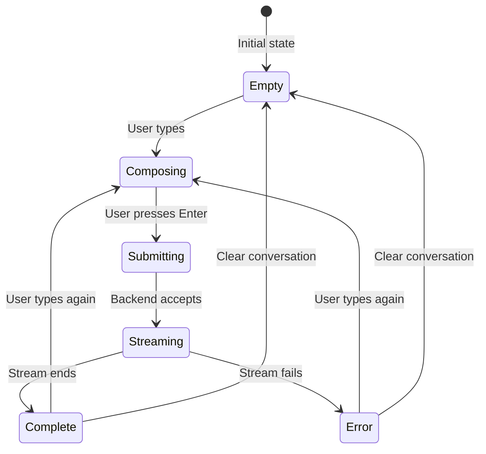

# Design Document: Interactive Groq Chat

## Overview

The Interactive Groq Chat feature adds a real-time conversational AI interface to the AskBetter application, enabling users to have ChatGPT-like conversations powered by Groq's LLM API. This feature integrates the existing ChatPage component with the backend streaming infrastructure to provide a polished, responsive chat experience.

### Design Goals

1. **Seamless Integration**: Leverage existing ChatPage UI and backend streaming endpoint with minimal modifications
2. **Real-Time Responsiveness**: Stream AI responses token-by-token for immediate user feedback
3. **Robust Error Handling**: Gracefully handle network failures, API errors, and edge cases
4. **Conversation Context**: Maintain full conversation history for multi-turn contextual discussions
5. **User Experience Polish**: Match modern AI chat interface standards with smooth interactions

### Key Design Decisions

- **Client-Side State Management**: Use React useState for conversation history (no Redux/Zustand needed for MVP)
- **Server-Sent Events (SSE)**: Continue using SSE for streaming (already implemented, proven reliable)
- **Stateless Backend**: Backend remains stateless; all conversation context managed client-side
- **Route-Based Navigation**: Chat accessible via `/chat` route, integrated with existing React Router setup
- **No Persistence**: Conversation history cleared on navigation away (consistent with MVP constraints)

## Architecture

### System Components

```mermaid
graph TB
    subgraph "Frontend (React)"
        A[App.tsx Router] --> B[ChatPage Component]
        B --> C[Message Display]
        B --> D[Input Controls]
        B --> E[Error Display]
        B --> F[Loading States]
    end
    
    subgraph "Client Library"
        G[chatClient.ts] --> H[SSE Parser]
        G --> I[Error Handler]
    end
    
    subgraph "Backend (Express)"
        J[/api/chat/stream] --> K[Request Validator]
        K --> L[Groq API Client]
        L --> M[SSE Transformer]
    end
    
    subgraph "External"
        N[Groq API]
    end
    
    B --> G
    G --> J
    L --> N
    N --> L
    M --> G
    H --> B
```

### Data Flow

1. **User Input Flow**:
   - User types message → ChatPage validates → Appends to local state → Calls streamChatReply
   - streamChatReply sends full message history to backend
   - Backend validates, forwards to Groq with streaming enabled

2. **Response Streaming Flow**:
   - Groq streams SSE events → Backend parses and transforms → Forwards to client
   - Client SSE parser extracts tokens → Calls onToken handler
   - ChatPage updates assistant message incrementally in state
   - React re-renders message bubble with new content

3. **Error Flow**:
   - Error occurs at any layer → Propagates via SSE error event or exception
   - ChatPage displays error, removes empty assistant placeholder, re-enables input

### Component Hierarchy

```
App.tsx
└── BrowserRouter
    └── Routes
        ├── Route path="/" → InputPage
        ├── Route path="/results" → ResultsPage
        └── Route path="/chat" → ChatPage ← NEW
            ├── Header (Back button, Title, Clear button)
            ├── MessageList (Scrollable container)
            │   └── MessageBubble[] (User/Assistant messages)
            ├── ErrorDisplay (Conditional)
            └── InputArea
                ├── Textarea (Multi-line input)
                └── SendButton (Icon + loading state)
```

## Components and Interfaces

### Frontend Components

#### ChatPage Component (Modified)

**Location**: `askbetter/src/pages/ChatPage.tsx`

**State Management**:
```typescript
interface ChatPageState {
  messages: ChatMessage[];        // Full conversation history
  input: string;                  // Current input field value
  isStreaming: boolean;           // Streaming in progress flag
  error: string;                  // Current error message (empty if none)
}
```

**Key Methods**:
- `sendMessage()`: Validates input, updates state, initiates streaming
- `clearConversation()`: Prompts confirmation, resets message history
- `handleKeyDown()`: Detects Enter (submit) vs Shift+Enter (newline)

**Props**: None (route-level component)

**Responsibilities**:
- Manage conversation state (messages array)
- Handle user input and submission
- Coordinate with chatClient for streaming
- Display messages, errors, and loading states
- Provide conversation clearing functionality

#### MessageBubble Component (New)

**Location**: `askbetter/src/components/MessageBubble.tsx`

**Props**:
```typescript
interface MessageBubbleProps {
  role: 'user' | 'assistant';
  content: string;
  isStreaming?: boolean;
}
```

**Responsibilities**:
- Render individual message with role-appropriate styling
- Handle empty content during streaming (show "…" placeholder)
- Preserve whitespace and line breaks in content

### Client Library

#### chatClient.ts (Modified)

**Location**: `askbetter/src/lib/chatClient.ts`

**Existing Interface**:
```typescript
export interface ChatMessage {
  role: 'user' | 'assistant';
  content: string;
}

export interface StreamHandlers {
  onToken: (text: string) => void;
  onError?: (message: string) => void;
}

export async function streamChatReply(
  messages: ChatMessage[],
  handlers: StreamHandlers
): Promise<void>
```

**Modifications Needed**:
- Add better error message mapping for HTTP status codes
- Improve SSE parsing robustness (handle malformed chunks)
- Add connection abort handling

**Responsibilities**:
- Establish SSE connection to backend
- Parse SSE event stream (event type + data payload)
- Extract tokens from "token" events
- Extract error messages from "error" events
- Detect stream completion from "end" events
- Handle network failures and timeouts

### Backend API

#### POST /api/chat/stream (Modified)

**Location**: `server/index.js`

**Request Body**:
```typescript
{
  messages: Array<{
    role: 'user' | 'assistant';
    content: string;
  }>;
}
```

**Response**: Server-Sent Events stream

**SSE Event Types**:
```typescript
// Token event - incremental content
event: token
data: {"text": "Hello"}

// Error event - streaming failure
event: error
data: {"code": "UPSTREAM_ERROR", "message": "Groq API failed"}

// End event - stream completion
event: end
data: {"done": true}
```

**Validation Rules** (existing):
- Messages must be non-empty array
- Maximum 50 messages
- Maximum 4000 characters per message
- Maximum 20000 total characters
- Each message must have valid role and non-empty content

**Error Codes**:
- `INVALID_API_KEY`: Groq authentication failed (401/403)
- `UPSTREAM_ERROR`: Groq API error (4xx/5xx)
- `STREAM_FAILURE`: Network or parsing error
- `VALIDATION_ERROR`: Request validation failed (400)

**Modifications Needed**:
- Improve error event formatting for client consumption
- Add request abort handling on client disconnect
- Enhance logging for debugging

#### Groq API Integration

**Endpoint**: `https://api.groq.com/openai/v1/chat/completions`

**Request Format**:
```typescript
{
  model: "llama-3.1-8b-instant",
  messages: ChatMessage[],
  stream: true
}
```

**Response Format**: OpenAI-compatible SSE stream
```
data: {"choices":[{"delta":{"content":"Hello"}}]}
data: {"choices":[{"delta":{"content":" world"}}]}
data: [DONE]
```

**Authentication**: Bearer token via `Authorization` header

## Data Models

### Core Types

```typescript
// Shared between frontend and backend
export type ChatRole = 'user' | 'assistant';

export interface ChatMessage {
  role: ChatRole;
  content: string;
}
```

### State Models

```typescript
// Frontend conversation state
interface ConversationState {
  messages: ChatMessage[];
  currentInput: string;
  streamingState: 'idle' | 'streaming' | 'error';
  errorMessage: string | null;
}

// Backend validation result
interface ValidationResult {
  ok: boolean;
  error: string | null;
}

// SSE event payload types
type TokenEvent = { text: string };
type ErrorEvent = { code: string; message: string };
type EndEvent = { done: boolean };
```

### Message Flow State Machine



## Error Handling

### Error Categories and Responses

| Error Type | Detection | User Message | Recovery |
|------------|-----------|--------------|----------|
| Empty input | Client validation | (Button disabled) | N/A |
| Network failure | Fetch exception | "Network error - please check your connection" | Retry |
| API key invalid | 401/403 status | "API authentication failed - please check server configuration" | Admin action required |
| Service unavailable | 503 status | "Chat service is temporarily unavailable" | Retry later |
| Rate limit | 429 status | "Too many requests - please wait a moment" | Wait and retry |
| Validation error | 400 status | Backend error message | Fix input |
| Upstream error | 5xx status | "AI service error - please try again" | Retry |
| Stream interrupted | Connection closed | "Connection lost - please try again" | Retry |
| Malformed SSE | Parse exception | (Ignored, continue streaming) | Continue |

### Error Handling Strategy

1. **Client-Side Validation**: Prevent invalid requests before submission
2. **Graceful Degradation**: Remove empty assistant message on error
3. **User-Friendly Messages**: Map technical errors to actionable user messages
4. **State Recovery**: Always re-enable input after error
5. **Silent Failures**: Ignore malformed SSE chunks, continue processing stream

### Error Display

- Display error message below message list, above input area
- Use red text with subtle background for visibility
- Clear error on next successful submission
- Don't block UI - user can still navigate away

## Testing Strategy

### Testing Approach

This feature is **NOT suitable for property-based testing** because:
- Primary focus is UI rendering and interaction
- Heavy reliance on external API (Groq) with non-deterministic responses
- Streaming behavior involves network I/O and side effects
- Most requirements test specific state transitions, not universal properties

Instead, we will use:
1. **Unit Tests**: Test individual functions and components in isolation
2. **Integration Tests**: Test client-server communication with mocked Groq API
3. **E2E Tests**: Test full user workflows (future consideration)

### Unit Testing Strategy

**Frontend Unit Tests** (React Testing Library + Vitest):

1. **ChatPage Component**:
   - Input validation (empty input disables button)
   - Message submission (Enter key, button click)
   - State updates (messages array, streaming flag)
   - Error display and clearing
   - Clear conversation confirmation flow
   - Keyboard shortcuts (Enter vs Shift+Enter)

2. **MessageBubble Component**:
   - Role-based styling (user vs assistant)
   - Content rendering with whitespace preservation
   - Streaming placeholder display

3. **chatClient.ts**:
   - SSE event parsing (token, error, end events)
   - Buffer handling for incomplete chunks
   - Error extraction and mapping
   - Handler invocation (onToken, onError)

**Backend Unit Tests** (Jest or Mocha):

1. **Request Validation**:
   - Empty messages array rejection
   - Message count limit (50 max)
   - Character limits (4000 per message, 20000 total)
   - Role validation (user/assistant only)
   - Content validation (non-empty strings)

2. **SSE Transformation**:
   - Groq response parsing
   - Event formatting (token, error, end)
   - Content delta extraction

3. **Error Handling**:
   - HTTP status code mapping
   - Groq error response parsing
   - Abort signal handling

### Integration Testing Strategy

**Client-Server Integration Tests**:

1. **Successful Streaming Flow**:
   - Send valid message history
   - Receive token events in sequence
   - Receive end event
   - Verify complete message assembled

2. **Error Scenarios**:
   - Invalid API key (401) → Error event with INVALID_API_KEY
   - Validation failure (400) → Error response with message
   - Groq API error (5xx) → Error event with UPSTREAM_ERROR
   - Network timeout → Exception handling

3. **Connection Management**:
   - Client disconnect during streaming → Backend aborts Groq request
   - Stream completion → Connection closed cleanly

**Mock Strategy**:
- Mock Groq API responses using nock or MSW
- Test various response patterns (fast, slow, error, malformed)
- Verify backend correctly transforms and forwards events

### Test Coverage Goals

- **Frontend Components**: 80%+ coverage
- **chatClient.ts**: 90%+ coverage (critical path)
- **Backend Validation**: 100% coverage (security-critical)
- **Backend Streaming**: 85%+ coverage

### Testing Tools Setup

**Frontend**:
```json
{
  "devDependencies": {
    "vitest": "^2.0.0",
    "@testing-library/react": "^16.0.0",
    "@testing-library/user-event": "^14.5.0",
    "@testing-library/jest-dom": "^6.0.0"
  }
}
```

**Backend**:
```json
{
  "devDependencies": {
    "jest": "^29.0.0",
    "supertest": "^7.0.0",
    "nock": "^13.0.0"
  }
}
```

### Example Test Cases

**Frontend Example**:
```typescript
describe('ChatPage', () => {
  it('should disable send button when input is empty', () => {
    render(<ChatPage />);
    const sendButton = screen.getByRole('button', { name: /send/i });
    expect(sendButton).toBeDisabled();
  });

  it('should submit message on Enter key', async () => {
    const user = userEvent.setup();
    render(<ChatPage />);
    const input = screen.getByPlaceholderText(/type your message/i);
    
    await user.type(input, 'Hello AI{Enter}');
    
    expect(screen.getByText('Hello AI')).toBeInTheDocument();
  });

  it('should display error message on stream failure', async () => {
    // Mock streamChatReply to throw error
    vi.mock('../lib/chatClient', () => ({
      streamChatReply: vi.fn().mockRejectedValue(new Error('Network error'))
    }));
    
    render(<ChatPage />);
    // ... submit message ...
    
    await waitFor(() => {
      expect(screen.getByText(/network error/i)).toBeInTheDocument();
    });
  });
});
```

**Backend Example**:
```javascript
describe('POST /api/chat/stream', () => {
  it('should reject requests with too many messages', async () => {
    const messages = Array(51).fill({ role: 'user', content: 'test' });
    
    const response = await request(app)
      .post('/api/chat/stream')
      .send({ messages });
    
    expect(response.status).toBe(400);
    expect(response.body.error).toContain('cannot exceed 50');
  });

  it('should stream tokens from Groq API', async () => {
    nock('https://api.groq.com')
      .post('/openai/v1/chat/completions')
      .reply(200, 'data: {"choices":[{"delta":{"content":"Hello"}}]}\n\ndata: [DONE]\n\n');
    
    const response = await request(app)
      .post('/api/chat/stream')
      .send({ messages: [{ role: 'user', content: 'Hi' }] });
    
    expect(response.headers['content-type']).toContain('text/event-stream');
    // Verify SSE events in response body
  });
});
```

### Manual Testing Checklist

- [ ] Send first message, verify streaming works
- [ ] Send follow-up message, verify context maintained
- [ ] Test with very long message (near 4000 char limit)
- [ ] Test with rapid successive messages
- [ ] Test clear conversation with confirmation
- [ ] Test navigation away and back (history cleared)
- [ ] Test with invalid API key (error display)
- [ ] Test with network disconnected (error handling)
- [ ] Test Shift+Enter for multi-line input
- [ ] Test Enter key submission
- [ ] Test button click submission
- [ ] Verify loading states during streaming
- [ ] Verify button disabled states
- [ ] Verify message alignment (user right, assistant left)
- [ ] Verify auto-scroll to latest message

## Implementation Notes

### Phase 1: Core Integration (Priority 1)

1. Add `/chat` route to App.tsx
2. Verify ChatPage renders and navigation works
3. Test message submission and state updates
4. Verify streaming integration with existing backend

### Phase 2: Error Handling (Priority 1)

1. Implement error display in ChatPage
2. Add error message mapping in chatClient
3. Test all error scenarios
4. Verify state recovery after errors

### Phase 3: Conversation Clearing (Priority 2)

1. Add clear button to ChatPage header
2. Implement confirmation dialog
3. Wire up state reset
4. Test edge cases (clear during streaming)

### Phase 4: Polish (Priority 2)

1. Refine loading states and animations
2. Improve message bubble styling
3. Add smooth scroll behavior
4. Test keyboard shortcuts
5. Verify responsive behavior

### Phase 5: Testing (Priority 1)

1. Set up Vitest for frontend
2. Write unit tests for ChatPage
3. Write unit tests for chatClient
4. Set up Jest for backend
5. Write backend validation tests
6. Write integration tests

### Known Limitations

1. **No Persistence**: Conversation lost on navigation/refresh (acceptable for MVP)
2. **No Message Editing**: Cannot edit or delete sent messages (future enhancement)
3. **No Conversation History**: Cannot save or load past conversations (future enhancement)
4. **No Streaming Cancellation**: Cannot stop generation mid-stream (future enhancement)
5. **No Token Count Display**: No visibility into token usage (future enhancement)
6. **No Model Selection**: Fixed to llama-3.1-8b-instant (future enhancement)

### Security Considerations

1. **Input Validation**: Backend validates all message content (already implemented)
2. **Rate Limiting**: Backend enforces message count and size limits (already implemented)
3. **API Key Protection**: GROQ_API_KEY never exposed to client (already implemented)
4. **CORS**: Backend restricts origins (already implemented)
5. **Content Sanitization**: React automatically escapes content (built-in protection)

### Performance Considerations

1. **Message Rendering**: Use React.memo for MessageBubble to prevent unnecessary re-renders
2. **Scroll Performance**: Use CSS scroll-behavior: smooth instead of JS scrolling
3. **State Updates**: Batch token updates (already done via React's automatic batching)
4. **Memory**: No concern for MVP (50 message limit keeps memory bounded)

### Accessibility Considerations

1. **Keyboard Navigation**: Full keyboard support (Enter, Shift+Enter, Tab)
2. **Focus Management**: Input auto-focused after message sent
3. **Screen Readers**: Semantic HTML (button, textarea) with aria-labels
4. **Color Contrast**: Ensure message bubbles meet WCAG AA standards
5. **Loading States**: Announce streaming status to screen readers (aria-live)

### Browser Compatibility

- **Target**: Modern evergreen browsers (Chrome, Firefox, Safari, Edge)
- **SSE Support**: All modern browsers support EventSource/fetch streams
- **CSS**: Tailwind v4 generates compatible CSS
- **JavaScript**: ES2023 features supported by Vite's default targets

## Deployment Considerations

### Environment Variables

**Frontend** (`.env` in `askbetter/`):
```
VITE_PROXY_URL=http://localhost:3001
```

**Backend** (`.env` in `server/`):
```
GROQ_API_KEY=gsk_...
PORT=3001
```

### Production Checklist

- [ ] Set VITE_PROXY_URL to production backend URL
- [ ] Configure CORS to allow production frontend domain
- [ ] Set up GROQ_API_KEY in production environment
- [ ] Enable HTTPS for backend (required for production)
- [ ] Add rate limiting middleware (express-rate-limit)
- [ ] Set up error logging (e.g., Sentry)
- [ ] Configure CDN for frontend assets
- [ ] Test with production Groq API quota

### Monitoring and Observability

**Metrics to Track**:
- Message submission rate
- Streaming success/failure rate
- Average response time
- Error rate by type
- Token throughput

**Logging**:
- Backend: Log all requests, errors, and Groq API responses
- Frontend: Log errors to console (or error tracking service)

## Future Enhancements

### Short-Term (Post-MVP)

1. **Streaming Cancellation**: Add stop button to abort generation
2. **Message Editing**: Allow editing sent messages
3. **Conversation Export**: Download conversation as JSON/Markdown
4. **Token Counter**: Display token usage per message
5. **Retry Failed Messages**: One-click retry for failed submissions

### Medium-Term

1. **Conversation Persistence**: Save conversations to localStorage or backend
2. **Multiple Conversations**: Sidebar with conversation list
3. **Model Selection**: Choose between different Groq models
4. **System Prompts**: Configure AI behavior with custom system messages
5. **Message Reactions**: Like/dislike messages for feedback

### Long-Term

1. **Conversation Analysis**: Apply AskBetter analysis to chat conversations
2. **Prompt Suggestions**: Real-time suggestions while typing
3. **Voice Input**: Speech-to-text for message input
4. **Collaborative Chats**: Share conversations with others
5. **RAG Integration**: Connect to knowledge bases for enhanced responses

## Conclusion

This design provides a solid foundation for the Interactive Groq Chat feature, leveraging existing infrastructure while adding robust error handling, conversation management, and a polished user experience. The architecture is simple, maintainable, and aligned with the project's MVP constraints. The testing strategy ensures reliability without over-engineering, and the implementation plan provides a clear path from current state to production-ready feature.
