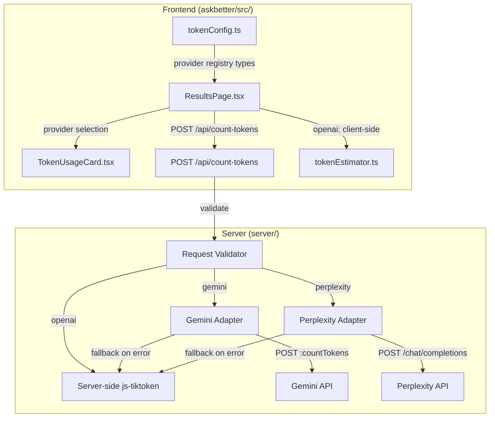
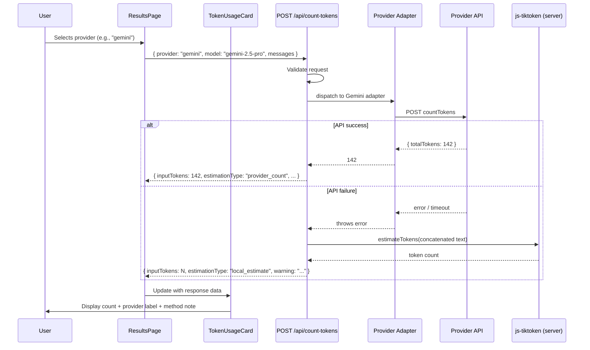
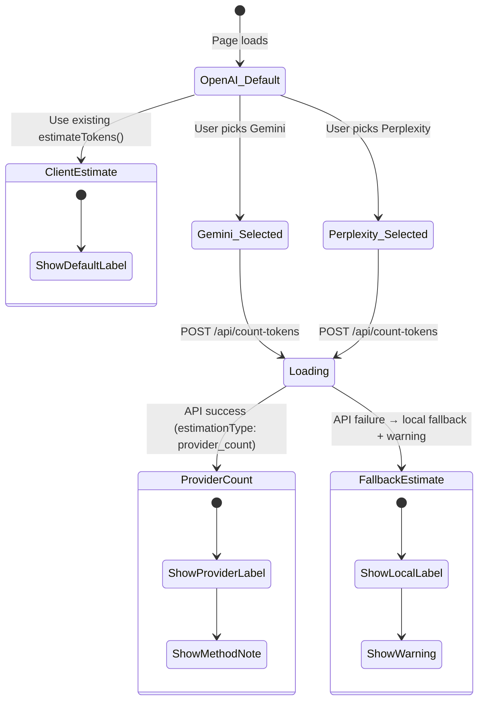
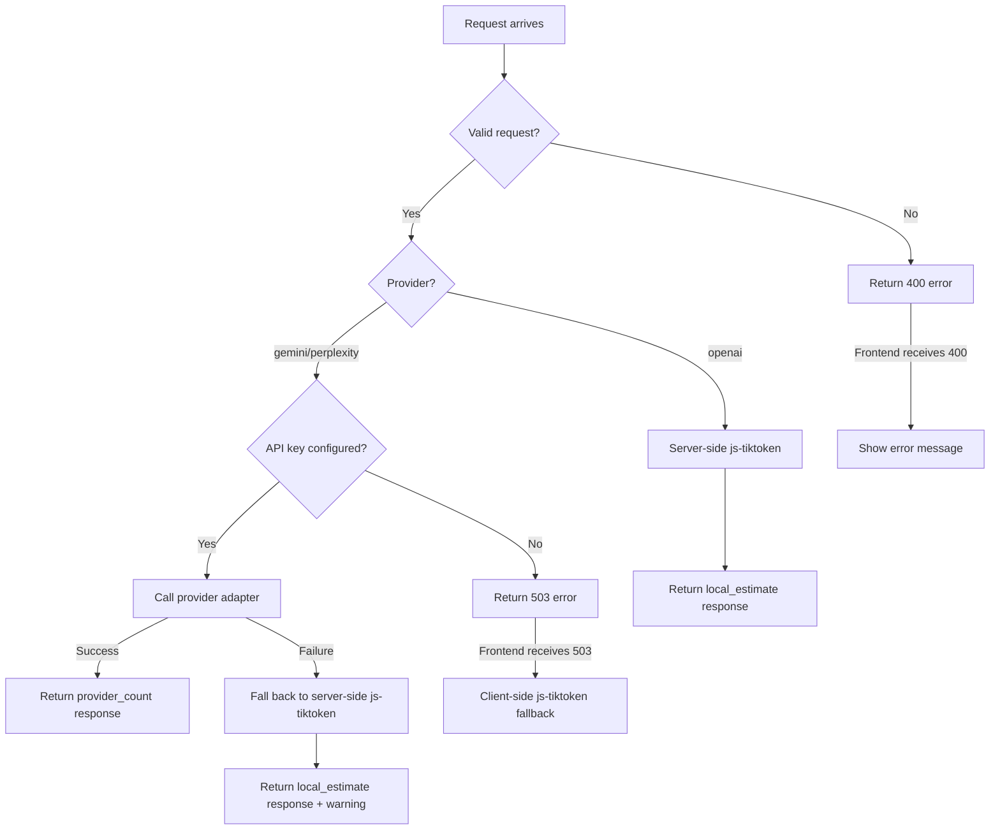

# Design Document: Multi-Provider Token Counting

## Overview

This feature extends AskBetter's existing client-side token estimation to support three distinct providers — OpenAI, Gemini, and Perplexity — each with its own token-counting mechanism. OpenAI continues to use the existing client-side `js-tiktoken` estimator. Gemini uses Google's dedicated `countTokens` REST endpoint, which returns exact token counts without generating a completion. Perplexity has no dedicated token-counting endpoint; instead, a minimal chat completion request is sent to the Sonar API and the `usage.prompt_tokens` field is read from the response.

The design introduces:

1. **Provider Registry** — a typed configuration system mapping each provider to its model, API key env var, and endpoint.
2. **Server-side adapters** — Gemini and Perplexity adapter functions in the Express server that call provider APIs with proper authentication and timeout handling.
3. **Normalized endpoint** — a single `POST /api/count-tokens` route that accepts a provider-agnostic request, dispatches to the correct adapter, and returns a uniform response.
4. **Fallback mechanism** — if any provider API fails, the server falls back to server-side `js-tiktoken` estimation and flags the response accordingly.
5. **Frontend provider selection** — a UI control on the Results page letting users pick a provider, with the TokenUsageCard updated to show provider-specific labels and estimation method notes.

### Design Goals

1. **Single Responsibility**: Each adapter handles exactly one provider's API. The endpoint handles routing and fallback. The frontend handles display.
2. **Security**: API keys live exclusively in server-side environment variables. No key material ever reaches the frontend.
3. **Graceful Degradation**: Every code path produces a valid token count. Provider API failures fall back to local estimation with a warning.
4. **Backward Compatibility**: The default provider is OpenAI (local estimation), preserving existing behavior for users who don't interact with the provider selector.
5. **Extensibility**: Adding a new provider means adding one config entry and one adapter function.

### Key Design Decisions

- **Server-side `js-tiktoken` for OpenAI and fallback**: The server installs `js-tiktoken` so that the `POST /api/count-tokens` endpoint can handle OpenAI requests and fallback scenarios without requiring a client-side round-trip. The existing client-side estimator remains for the default (no server call) path.
- **`node-fetch` for adapter HTTP calls**: The server already depends on `node-fetch@2` (CommonJS-compatible). Adapters use it with `AbortController` for timeout enforcement.
- **Minimal Perplexity request**: Setting `max_tokens: 1` minimizes cost and latency since we only need the `usage.prompt_tokens` field, not the generated text.
- **Gemini `contents` format conversion**: Messages are converted from the normalized `{ role, content }` format to Gemini's `{ role, parts: [{ text }] }` format in the adapter.
- **Provider selector defaults to OpenAI**: When the user hasn't selected a provider, the frontend uses the existing client-side `estimateTokens()` function — no server call needed. This preserves the current zero-latency experience.
- **CommonJS throughout server**: The server uses `require()` / `module.exports` consistent with the existing `server/index.js` codebase (`"type": "commonjs"` in `server/package.json`).

### Research Findings

**Gemini countTokens API** ([source](https://ai.google.dev/api/tokens)):
- Endpoint: `POST https://generativelanguage.googleapis.com/v1beta/models/{model}:countTokens`
- Authentication: API key passed as `?key=` query parameter
- Request body: `{ contents: [{ role, parts: [{ text }] }] }`
- Response body: `{ totalTokens: number }` (always non-negative)
- No cost incurred for countTokens calls

**Perplexity Sonar API** ([source](https://docs.perplexity.ai/api-reference/sonar-post)):
- Endpoint: `POST https://api.perplexity.ai/chat/completions`
- Authentication: `Authorization: Bearer {key}` header
- OpenAI-compatible request format: `{ model, messages, max_tokens }`
- Response includes `usage: { prompt_tokens, completion_tokens, total_tokens }` and optionally `usage.cost: { input_tokens_cost, output_tokens_cost, total_cost }`
- Setting `max_tokens: 1` minimizes output cost while still returning usage metadata

## Architecture

### System Components



### Request/Response Flow



### Module Dependency Graph

```
── Server ──────────────────────────────────────────
server/
├── index.js              (Express app, imports adapters + validator)
├── adapters/
│   ├── geminiAdapter.js  (calls Gemini countTokens API)
│   ├── perplexityAdapter.js (calls Perplexity chat completions API)
│   └── localEstimator.js (server-side js-tiktoken wrapper)
├── providerRegistry.js   (provider config entries + lookup)
└── validateTokenRequest.js (request payload validation)

── Frontend ────────────────────────────────────────
askbetter/src/
├── analysis/
│   ├── tokenConfig.ts    (extended with provider types + registry)
│   ├── tokenEstimator.ts (unchanged — client-side fallback)
│   └── costCalculator.ts (unchanged)
├── components/
│   └── TokenUsageCard.tsx (extended with provider labels + method notes)
└── pages/
    └── ResultsPage.tsx   (adds provider selector + server call logic)
```

## Components and Interfaces

### Provider Registry (server/providerRegistry.js)

Defines the `TokenProvider` union and `TokenConfigEntry` shape, plus a lookup function.

```javascript
// server/providerRegistry.js
const PROVIDERS = {
  openai: {
    provider: 'openai',
    model: 'gpt-4o',
    apiKeyEnv: '',
    endpoint: 'local',
  },
  gemini: {
    provider: 'gemini',
    model: 'gemini-2.5-pro',
    apiKeyEnv: 'GEMINI_API_KEY',
    endpoint: ':countTokens',
  },
  perplexity: {
    provider: 'perplexity',
    model: 'sonar-pro',
    apiKeyEnv: 'PERPLEXITY_API_KEY',
    endpoint: '/chat/completions',
  },
};

const VALID_PROVIDERS = Object.keys(PROVIDERS);

function getProviderConfig(providerName) {
  return PROVIDERS[providerName] || null;
}

module.exports = { PROVIDERS, VALID_PROVIDERS, getProviderConfig };
```

### Request Validator (server/validateTokenRequest.js)

Validates the normalized request payload before dispatching to adapters.

```javascript
// server/validateTokenRequest.js
const { VALID_PROVIDERS, getProviderConfig } = require('./providerRegistry');

function validateTokenRequest(body) {
  if (!body.provider) {
    return { valid: false, status: 400, message: 'provider field is required' };
  }
  if (!VALID_PROVIDERS.includes(body.provider)) {
    return { valid: false, status: 400, message: 'unsupported provider' };
  }
  if (!Array.isArray(body.messages) || body.messages.length === 0) {
    return { valid: false, status: 400, message: 'messages must be a non-empty array' };
  }
  for (const msg of body.messages) {
    if (!msg || typeof msg.role !== 'string' || typeof msg.content !== 'string') {
      return { valid: false, status: 400, message: 'each message must have role and content strings' };
    }
  }
  // Default model from registry if not provided
  if (!body.model) {
    const config = getProviderConfig(body.provider);
    body.model = config.model;
  }
  return { valid: true };
}

module.exports = { validateTokenRequest };
```

### Gemini Adapter (server/adapters/geminiAdapter.js)

Calls the Gemini `countTokens` endpoint with a 10-second timeout.

```javascript
// server/adapters/geminiAdapter.js
const fetch = require('node-fetch');

async function countTokensGemini(messages, model) {
  const apiKey = process.env.GEMINI_API_KEY;
  if (!apiKey) {
    const err = new Error('GEMINI_API_KEY is not configured');
    err.statusCode = 503;
    throw err;
  }

  const contents = messages.map((msg) => ({
    role: msg.role === 'assistant' ? 'model' : 'user',
    parts: [{ text: msg.content }],
  }));

  const url = `https://generativelanguage.googleapis.com/v1beta/models/${model}:countTokens?key=${apiKey}`;

  const controller = new AbortController();
  const timeout = setTimeout(() => controller.abort(), 10_000);

  try {
    const response = await fetch(url, {
      method: 'POST',
      headers: { 'Content-Type': 'application/json' },
      body: JSON.stringify({ contents }),
      signal: controller.signal,
    });

    if (!response.ok) {
      const errorBody = await response.text();
      throw new Error(`Gemini API error ${response.status}: ${errorBody}`);
    }

    const data = await response.json();
    return data.totalTokens;
  } catch (err) {
    if (err.name === 'AbortError') {
      throw new Error('Gemini API request timed out after 10 seconds');
    }
    throw err;
  } finally {
    clearTimeout(timeout);
  }
}

module.exports = { countTokensGemini };
```

### Perplexity Adapter (server/adapters/perplexityAdapter.js)

Calls the Perplexity chat completions endpoint with `max_tokens: 1` and a 15-second timeout.

```javascript
// server/adapters/perplexityAdapter.js
const fetch = require('node-fetch');

async function countTokensPerplexity(messages, model) {
  const apiKey = process.env.PERPLEXITY_API_KEY;
  if (!apiKey) {
    const err = new Error('PERPLEXITY_API_KEY is not configured');
    err.statusCode = 503;
    throw err;
  }

  const controller = new AbortController();
  const timeout = setTimeout(() => controller.abort(), 15_000);

  try {
    const response = await fetch('https://api.perplexity.ai/chat/completions', {
      method: 'POST',
      headers: {
        'Authorization': `Bearer ${apiKey}`,
        'Content-Type': 'application/json',
      },
      body: JSON.stringify({ model, messages, max_tokens: 1 }),
      signal: controller.signal,
    });

    if (!response.ok) {
      const errorBody = await response.text();
      throw new Error(`Perplexity API error ${response.status}: ${errorBody}`);
    }

    const data = await response.json();
    const result = { inputTokens: data.usage.prompt_tokens };

    if (data.usage?.cost) {
      result.cost = {
        input_tokens_cost: data.usage.cost.input_tokens_cost,
        output_tokens_cost: data.usage.cost.output_tokens_cost,
        total_cost: data.usage.cost.total_cost,
      };
    }

    return result;
  } catch (err) {
    if (err.name === 'AbortError') {
      throw new Error('Perplexity API request timed out after 15 seconds');
    }
    throw err;
  } finally {
    clearTimeout(timeout);
  }
}

module.exports = { countTokensPerplexity };
```

### Local Estimator — Server-side (server/adapters/localEstimator.js)

Wraps `js-tiktoken` for server-side use, mirroring the client-side `tokenEstimator.ts`.

```javascript
// server/adapters/localEstimator.js
const { Tiktoken } = require('js-tiktoken/lite');
const cl100k_base = require('js-tiktoken/ranks/cl100k_base');

let encoder = null;
let initFailed = false;

try {
  encoder = new Tiktoken(cl100k_base);
} catch {
  initFailed = true;
}

function estimateTokensLocal(text) {
  if (initFailed || !encoder) {
    return 0;
  }
  if (!text || text.length === 0) {
    return 0;
  }
  try {
    return encoder.encode(text).length;
  } catch {
    return 0;
  }
}

function estimateTokensFromMessages(messages) {
  const concatenated = messages.map((m) => m.content).join('\n');
  return estimateTokensLocal(concatenated);
}

module.exports = { estimateTokensLocal, estimateTokensFromMessages };
```

### Token Counting Endpoint (added to server/index.js)

The `POST /api/count-tokens` route is added to the existing Express app.

```javascript
// Added to server/index.js
const { validateTokenRequest } = require('./validateTokenRequest');
const { getProviderConfig } = require('./providerRegistry');
const { countTokensGemini } = require('./adapters/geminiAdapter');
const { countTokensPerplexity } = require('./adapters/perplexityAdapter');
const { estimateTokensFromMessages } = require('./adapters/localEstimator');

app.post('/api/count-tokens', async (req, res) => {
  const validation = validateTokenRequest(req.body);
  if (!validation.valid) {
    return res.status(validation.status).json({ error: validation.message });
  }

  const { provider, model, messages } = req.body;

  // OpenAI: use server-side js-tiktoken directly
  if (provider === 'openai') {
    const inputTokens = estimateTokensFromMessages(messages);
    return res.json({
      inputTokens,
      estimationType: 'local_estimate',
      provider,
      model,
    });
  }

  // Check API key availability
  const config = getProviderConfig(provider);
  if (config.apiKeyEnv && !process.env[config.apiKeyEnv]) {
    return res.status(503).json({
      error: `${config.apiKeyEnv} is not configured`,
    });
  }

  // Dispatch to provider adapter with fallback
  try {
    let inputTokens;

    if (provider === 'gemini') {
      inputTokens = await countTokensGemini(messages, model);
    } else if (provider === 'perplexity') {
      const result = await countTokensPerplexity(messages, model);
      inputTokens = result.inputTokens;
    }

    return res.json({
      inputTokens,
      estimationType: 'provider_count',
      provider,
      model,
    });
  } catch (err) {
    // Fallback to local estimation
    const inputTokens = estimateTokensFromMessages(messages);
    return res.json({
      inputTokens,
      estimationType: 'local_estimate',
      provider,
      model,
      warning: `${provider} API unavailable: ${err.message}. Fell back to local estimation.`,
    });
  }
});
```

### Frontend Provider Types (askbetter/src/analysis/tokenConfig.ts — extended)

```typescript
// Added to existing tokenConfig.ts

export type TokenProvider = 'openai' | 'gemini' | 'perplexity';
export type EstimationType = 'provider_count' | 'local_estimate';

export interface ProviderOption {
  provider: TokenProvider;
  label: string;
  model: string;
  methodNote: string;
}

export const PROVIDER_OPTIONS: ProviderOption[] = [
  {
    provider: 'openai',
    label: 'OpenAI · gpt-4o',
    model: 'gpt-4o',
    methodNote: 'Estimated locally.',
  },
  {
    provider: 'gemini',
    label: 'Gemini · gemini-2.5-pro',
    model: 'gemini-2.5-pro',
    methodNote: 'Counted via Gemini countTokens API.',
  },
  {
    provider: 'perplexity',
    label: 'Perplexity · sonar-pro',
    model: 'sonar-pro',
    methodNote: 'Counted via Perplexity chat completion usage field.',
  },
];

export interface NormalizedTokenResponse {
  inputTokens: number;
  estimationType: EstimationType;
  provider: TokenProvider;
  model: string;
  warning?: string;
}
```

### TokenUsageCard (extended)

The existing `TokenUsageCard` component is extended with new props for provider display:

```typescript
interface TokenUsageCardProps {
  totalTokens: number;
  estimatedCostUsd: number;
  breakdown: TokenBreakdownEntry[];
  label: string;
  disclaimer: string;
  // New props
  providerLabel?: string;       // e.g., "Gemini · gemini-2.5-pro"
  methodNote?: string;          // e.g., "Counted via Gemini countTokens API."
  warningNote?: string;         // Fallback warning when provider API failed
  isLoading?: boolean;          // Show loading indicator during API call
}
```

New rendering behavior:
- When `isLoading` is true, display a spinner/skeleton in place of the token count.
- When `providerLabel` is set, display it as the estimation label instead of the default.
- When `methodNote` is set, display it below the token count.
- When `warningNote` is set, display a warning banner indicating fallback occurred.
- The existing `disclaimer` continues to render at the bottom.

### ResultsPage (extended)

The ResultsPage adds:
1. A provider selector (three-button toggle or dropdown) above the TokenUsageCard.
2. State management for `selectedProvider`, `isCountingTokens`, `providerTokenResult`.
3. When `selectedProvider` is `"openai"`, use existing client-side estimation (no server call).
4. When `selectedProvider` is `"gemini"` or `"perplexity"`, call `POST /api/count-tokens` with the analyzed prompt texts as messages.
5. On server error or HTTP error, fall back to client-side estimation and show a warning.

## Data Models

### Normalized Request (Frontend → Server)

```typescript
interface NormalizedRequest {
  provider: TokenProvider;    // "openai" | "gemini" | "perplexity"
  model: string;              // e.g., "gemini-2.5-pro"
  messages: Array<{
    role: string;             // "user" | "assistant"
    content: string;          // message text
  }>;
}
```

### Normalized Response (Server → Frontend)

```typescript
interface NormalizedResponse {
  inputTokens: number;                    // token count (always non-negative)
  estimationType: EstimationType;         // "provider_count" | "local_estimate"
  provider: TokenProvider;                // echoed back
  model: string;                          // echoed back
  warning?: string;                       // present when fallback occurred
}
```

### Provider Config Entry (Server-side)

```javascript
{
  provider: string,     // "openai" | "gemini" | "perplexity"
  model: string,        // default model name
  apiKeyEnv: string,    // env var name (empty for client-side providers)
  endpoint: string,     // API path identifier
}
```

### State Flow



### Extended AnalysisResult Fields

No changes to the existing `AnalysisResult` interface. The provider-specific token data is managed as local component state in `ResultsPage`, separate from the analysis pipeline. The existing `totalPromptTokens`, `estimatedPromptCostUsd`, `tokenEstimateLabel`, and `tokenEstimateDisclaimer` fields continue to hold the default OpenAI/local estimation values from the analysis pipeline.


## Correctness Properties

*A property is a characteristic or behavior that should hold true across all valid executions of a system — essentially, a formal statement about what the system should do. Properties serve as the bridge between human-readable specifications and machine-verifiable correctness guarantees.*

### Property 1: Provider lookup correctness

*For any* string, calling `getProviderConfig(s)` SHALL return a non-null config object if and only if `s` is one of `"openai"`, `"gemini"`, or `"perplexity"`. For valid provider names, the returned config SHALL have `provider` equal to the input string. For all other strings, the function SHALL return `null`.

**Validates: Requirements 1.1, 1.6**

### Property 2: Gemini message format conversion preserves content

*For any* array of normalized messages (each with `role` and `content` strings), converting to Gemini's `contents` format SHALL produce an array of the same length where each element has a `role` field and a `parts` array containing exactly one object with a `text` field equal to the original message's `content`.

**Validates: Requirements 3.2**

### Property 3: Normalized response shape conformance

*For any* valid `NormalizedRequest` (valid provider, non-empty messages with role and content strings), the `POST /api/count-tokens` endpoint SHALL return a JSON response containing `inputTokens` (non-negative number), `estimationType` (one of `"provider_count"` or `"local_estimate"`), `provider` (matching the request), and `model` (a non-empty string).

**Validates: Requirements 5.5**

### Property 4: Invalid provider rejection

*For any* string that is not one of `"openai"`, `"gemini"`, or `"perplexity"`, the request validator SHALL reject the request with a `400` status and the message `"unsupported provider"`. If the provider field is missing entirely, the validator SHALL reject with `"provider field is required"`.

**Validates: Requirements 5.6, 9.1, 9.2**

### Property 5: Invalid messages rejection

*For any* request body where `messages` is missing, not an array, an empty array, or contains any element without both `role` and `content` as strings, the request validator SHALL reject the request with a `400` status and the appropriate error message.

**Validates: Requirements 5.7, 9.3, 9.4**

### Property 6: Fallback produces valid response with warning

*For any* provider adapter error (network failure, timeout, authentication error, server error), the `POST /api/count-tokens` endpoint SHALL return a valid `NormalizedResponse` with `estimationType` set to `"local_estimate"` and a `warning` string field describing the fallback reason. The `inputTokens` field SHALL be a non-negative number.

**Validates: Requirements 6.1, 6.3, 5.8**

### Property 7: Server-side local estimation is deterministic

*For any* string, calling the server-side `estimateTokensLocal(text)` function twice SHALL return the same non-negative integer result both times.

**Validates: Requirements 10.2, 10.4**

### Property 8: API keys never appear in responses

*For any* valid request to the `POST /api/count-tokens` endpoint, the JSON response body serialized as a string SHALL NOT contain the value of `GEMINI_API_KEY` or `PERPLEXITY_API_KEY` environment variables.

**Validates: Requirements 2.3**

## Error Handling

### Error Scenarios

| Scenario | Detection | HTTP Status | Response | User Impact |
|----------|-----------|-------------|----------|-------------|
| Missing `provider` field | Request validation | 400 | `{ error: "provider field is required" }` | Frontend shows validation error |
| Unsupported provider value | Request validation | 400 | `{ error: "unsupported provider" }` | Frontend shows validation error |
| Missing/empty/malformed `messages` | Request validation | 400 | `{ error: "messages must be a non-empty array" }` or `{ error: "each message must have role and content strings" }` | Frontend shows validation error |
| API key not configured | Env var check | 503 | `{ error: "{KEY_NAME} is not configured" }` | Frontend falls back to client-side estimation |
| Gemini API returns error | HTTP status check | 200 (fallback) | Normalized response with `estimationType: "local_estimate"` + `warning` | Token count shown with fallback warning |
| Gemini API timeout (>10s) | AbortController | 200 (fallback) | Normalized response with `estimationType: "local_estimate"` + `warning` | Token count shown with fallback warning |
| Perplexity API returns error | HTTP status check | 200 (fallback) | Normalized response with `estimationType: "local_estimate"` + `warning` | Token count shown with fallback warning |
| Perplexity API timeout (>15s) | AbortController | 200 (fallback) | Normalized response with `estimationType: "local_estimate"` + `warning` | Token count shown with fallback warning |
| Server-side js-tiktoken fails to load | try/catch at module load | 200 | `{ inputTokens: 0, estimationType: "local_estimate", ... }` | Zero tokens displayed |
| Frontend fetch to server fails | try/catch in fetch call | N/A (client) | Client-side fallback | Token count shown with local estimation + warning |

### Fallback Chain



### Frontend Error Handling

1. **Server unreachable**: If the `POST /api/count-tokens` fetch fails entirely (network error, CORS, server down), the frontend catches the error and falls back to the existing client-side `estimateTokens()` function. A warning note is displayed on the TokenUsageCard.
2. **HTTP 503 (key not configured)**: The frontend falls back to client-side estimation and shows a warning that the provider API is not available.
3. **HTTP 400 (validation error)**: Should not occur in normal operation since the frontend constructs valid requests. If it does, the error message is logged and client-side fallback is used.
4. **Slow responses**: The loading indicator is shown while the request is in progress. The user can switch back to OpenAI (instant, client-side) at any time.

## Testing Strategy

### Testing Approach

This feature has a mix of pure logic (provider registry, request validation, message format conversion, local estimation) and I/O-dependent code (adapter HTTP calls, Express endpoint). Property-based testing is well-suited for the pure logic layer, while the adapter and endpoint integration tests use example-based tests with mocked HTTP calls.

**Property-based testing library**: `fast-check` (already installed in `askbetter/` devDependencies)

For server-side tests, `fast-check` will also be added to `server/` devDependencies along with a test runner (Vitest or Jest — Vitest preferred for consistency with the frontend).

### Property-Based Tests

**Configuration**: Minimum 100 iterations per property test.

**Tag format**: Each test tagged with `Feature: multi-provider-token-counting, Property N: <title>`

1. **Feature: multi-provider-token-counting, Property 1: Provider lookup correctness**
   - Generator: `fc.string()` for invalid providers, `fc.constantFrom('openai', 'gemini', 'perplexity')` for valid ones
   - Assertion: Valid providers return matching config; invalid strings return null

2. **Feature: multi-provider-token-counting, Property 2: Gemini message format conversion preserves content**
   - Generator: `fc.array(fc.record({ role: fc.constantFrom('user', 'assistant'), content: fc.string({ minLength: 1 }) }), { minLength: 1, maxLength: 20 })`
   - Assertion: Output array same length, each element has correct role mapping and parts[0].text equals original content

3. **Feature: multi-provider-token-counting, Property 3: Normalized response shape conformance**
   - Generator: Valid request payloads with random messages and valid providers
   - Assertion: Response has all required fields with correct types (requires mocked adapters)

4. **Feature: multi-provider-token-counting, Property 4: Invalid provider rejection**
   - Generator: `fc.string().filter(s => !['openai', 'gemini', 'perplexity'].includes(s))`
   - Assertion: Validator returns `{ valid: false, status: 400 }` with correct message

5. **Feature: multi-provider-token-counting, Property 5: Invalid messages rejection**
   - Generator: Various malformed message structures (empty arrays, objects missing role/content, non-string fields)
   - Assertion: Validator returns `{ valid: false, status: 400 }` with appropriate message

6. **Feature: multi-provider-token-counting, Property 6: Fallback produces valid response with warning**
   - Generator: Random error types (Error, timeout, network) combined with valid request payloads
   - Assertion: Endpoint returns 200 with `estimationType: "local_estimate"` and non-empty `warning` string

7. **Feature: multi-provider-token-counting, Property 7: Server-side local estimation is deterministic**
   - Generator: `fc.string()`
   - Assertion: `estimateTokensLocal(s)` called twice returns identical non-negative integer results

8. **Feature: multi-provider-token-counting, Property 8: API keys never appear in responses**
   - Generator: Valid request payloads with random providers
   - Assertion: JSON.stringify(response) does not contain the API key values (requires mocked env vars and adapters)

### Unit Tests (Example-Based)

**Framework**: Vitest

**Server-side tests**:

1. **providerRegistry**:
   - `getProviderConfig('openai')` returns correct config
   - `getProviderConfig('gemini')` returns correct config
   - `getProviderConfig('perplexity')` returns correct config
   - `getProviderConfig('unknown')` returns null
   - All configs have required fields (provider, model, apiKeyEnv, endpoint)

2. **validateTokenRequest**:
   - Missing provider → 400 with "provider field is required"
   - Invalid provider → 400 with "unsupported provider"
   - Missing messages → 400 with "messages must be a non-empty array"
   - Empty messages array → 400 with "messages must be a non-empty array"
   - Message missing role → 400 with "each message must have role and content strings"
   - Message missing content → 400 with "each message must have role and content strings"
   - Valid request passes validation
   - Missing model defaults to provider's default model

3. **geminiAdapter** (with mocked fetch):
   - Successful response → returns totalTokens
   - Error response → throws with status code and message
   - Timeout → throws timeout error
   - Missing API key → throws 503 error
   - Message format conversion: user role stays "user", assistant role becomes "model"

4. **perplexityAdapter** (with mocked fetch):
   - Successful response → returns inputTokens from usage.prompt_tokens
   - Response with cost data → includes cost breakdown
   - Error response → throws with status code and message
   - Timeout → throws timeout error
   - Missing API key → throws 503 error
   - Request body includes max_tokens: 1

5. **localEstimator**:
   - Empty string → returns 0
   - Known string → returns expected token count
   - Deterministic: same input → same output

6. **count-tokens endpoint** (with mocked adapters):
   - OpenAI request → uses local estimator, returns local_estimate
   - Gemini request → dispatches to Gemini adapter, returns provider_count
   - Perplexity request → dispatches to Perplexity adapter, returns provider_count
   - Adapter failure → falls back to local estimation with warning
   - Missing API key → returns 503

**Frontend tests**:

7. **TokenUsageCard**:
   - Renders provider label when provided
   - Renders method note when provided
   - Renders warning note when provided
   - Shows loading indicator when isLoading is true
   - Renders disclaimer text
   - Renders default label when no provider label

8. **ResultsPage provider selection**:
   - Defaults to openai
   - Switching to gemini triggers server call
   - Switching to perplexity triggers server call
   - Switching back to openai uses client-side estimation
   - Server error triggers client-side fallback

### Test File Locations

```
server/__tests__/providerRegistry.test.js
server/__tests__/validateTokenRequest.test.js
server/__tests__/geminiAdapter.test.js
server/__tests__/perplexityAdapter.test.js
server/__tests__/localEstimator.test.js
server/__tests__/countTokensEndpoint.test.js
server/__tests__/providerRegistry.property.test.js
server/__tests__/validateTokenRequest.property.test.js
server/__tests__/localEstimator.property.test.js
askbetter/src/components/__tests__/TokenUsageCard.test.tsx
```

### Test Dependencies

**Server** (`server/package.json` devDependencies):
```json
{
  "vitest": "^4.1.5",
  "fast-check": "^4.7.0"
}
```

**Frontend** (already installed):
- `vitest` ^4.1.5
- `fast-check` ^4.7.0

### New Server Dependencies

**Production** (`server/package.json` dependencies):
```json
{
  "js-tiktoken": "^1.0.21"
}
```

### Coverage Goals

- `providerRegistry.js`: 100%
- `validateTokenRequest.js`: 100%
- `localEstimator.js`: 100%
- `geminiAdapter.js`: 90%+ (with mocked fetch)
- `perplexityAdapter.js`: 90%+ (with mocked fetch)
- `count-tokens endpoint`: 90%+
- `TokenUsageCard.tsx`: 80%+
