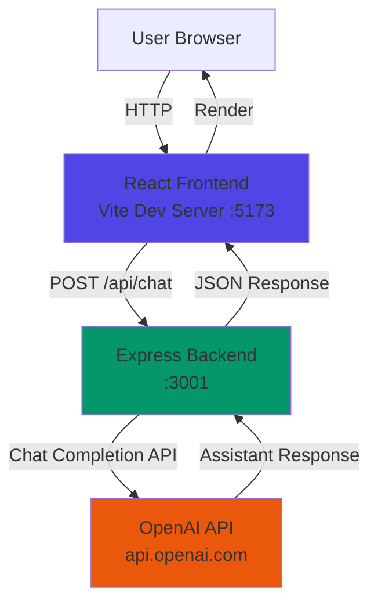
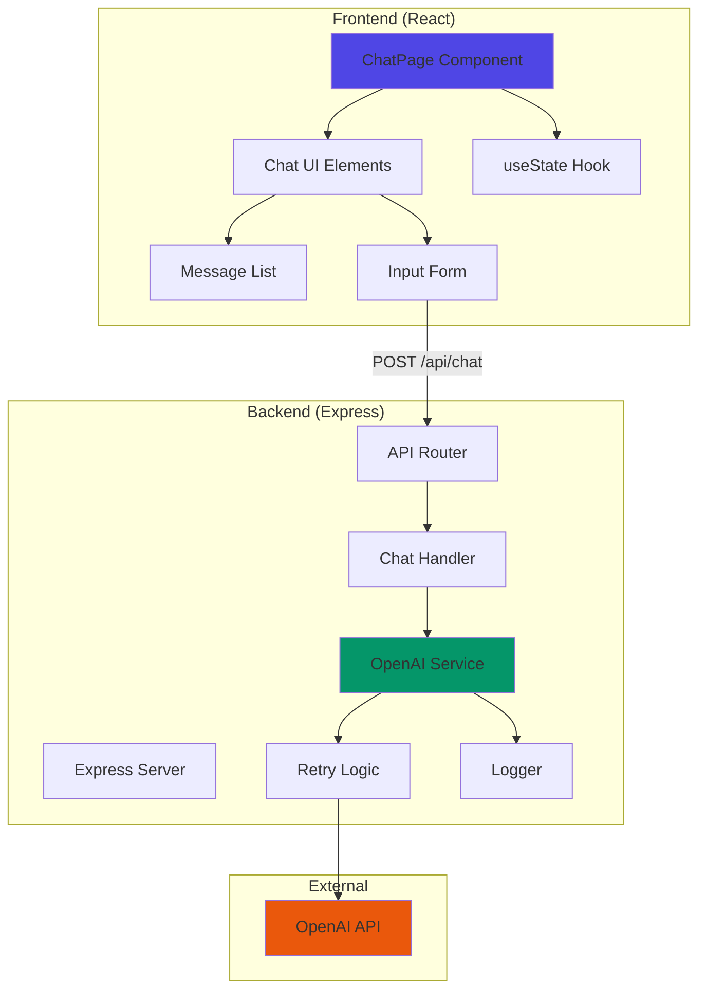

# Design Document: LLM Chat Integration

## Overview

This design specifies the architecture for integrating OpenAI's chat completion API into the AskBetter application. The system consists of three primary layers:

1. **Frontend Chat UI**: A React component that manages conversation state and renders messages
2. **Backend API Server**: An Express.js server that proxies requests to OpenAI while securing credentials
3. **OpenAI Integration Layer**: A service module that handles API communication, retries, and error mapping

The design prioritizes security (server-side credential management), resilience (exponential backoff retry logic), and user experience (loading states, error recovery, and markdown rendering).

### Key Design Decisions

- **Express over Fastify**: Express provides broader ecosystem support, more middleware options, and simpler debugging for this use case
- **Non-streaming responses initially**: Streaming adds complexity; we'll implement complete responses first and add streaming as an enhancement
- **Component-local state**: No global state management needed since chat state is scoped to a single component
- **Markdown rendering**: Using `react-markdown` for safe, flexible content rendering
- **Exponential backoff**: Prevents overwhelming the API during transient failures while providing quick retries for intermittent issues

## Architecture

### System Context Diagram



### Component Architecture



## Components and Interfaces

### Frontend Components

#### ChatPage Component

**Location**: `src/pages/ChatPage.tsx`

**Responsibilities**:
- Manage conversation state (array of messages)
- Handle user input submission
- Make HTTP requests to backend API
- Manage loading and error states
- Render chat UI

**State Shape**:
```typescript
interface Message {
  role: 'system' | 'user' | 'assistant';
  content: string;
}

interface ChatState {
  messages: Message[];
  isLoading: boolean;
  error: string | null;
}
```

**Key Methods**:
- `handleSendMessage(content: string): Promise<void>` - Appends user message, calls API, appends assistant response
- `clearError(): void` - Resets error state
- `resetConversation(): void` - Clears all messages

#### MessageList Component

**Location**: `src/components/MessageList.tsx`

**Responsibilities**:
- Render scrollable list of messages
- Auto-scroll to latest message
- Apply distinct styling for user vs assistant messages
- Render markdown in assistant messages

**Props**:
```typescript
interface MessageListProps {
  messages: Message[];
}
```

#### MessageInput Component

**Location**: `src/components/MessageInput.tsx`

**Responsibilities**:
- Provide text input field
- Handle Enter key submission
- Disable input during loading
- Clear input after submission

**Props**:
```typescript
interface MessageInputProps {
  onSend: (content: string) => void;
  disabled: boolean;
}
```

#### LoadingIndicator Component

**Location**: `src/components/LoadingIndicator.tsx`

**Responsibilities**:
- Display animated loading state
- Show typing indicator for assistant

**Props**:
```typescript
interface LoadingIndicatorProps {
  // No props needed - purely presentational
}
```

### Backend Components

#### Express Server

**Location**: `server/index.ts`

**Responsibilities**:
- Initialize Express application
- Configure middleware (CORS, JSON parsing, error handling)
- Load environment variables
- Register API routes
- Start HTTP server

**Configuration**:
```typescript
interface ServerConfig {
  port: number;
  corsOrigin: string;
  openaiApiKey: string;
}
```

#### API Router

**Location**: `server/routes/chat.ts`

**Responsibilities**:
- Define POST /api/chat endpoint
- Validate request payload
- Delegate to chat handler
- Return formatted responses

**Request Schema**:
```typescript
interface ChatRequest {
  messages: Message[];
}
```

**Response Schema**:
```typescript
interface ChatResponse {
  message: Message;
}

interface ErrorResponse {
  error: string;
  code?: string;
}
```

#### Chat Handler

**Location**: `server/handlers/chatHandler.ts`

**Responsibilities**:
- Validate message array structure
- Call OpenAI service
- Map service errors to HTTP responses
- Log request metrics

**Validation Rules**:
- Messages array must not be empty
- Each message must have `role` and `content` fields
- Role must be one of: 'system', 'user', 'assistant'
- Content must be a non-empty string

#### OpenAI Service

**Location**: `server/services/openaiService.ts`

**Responsibilities**:
- Initialize OpenAI SDK client
- Send chat completion requests
- Implement retry logic with exponential backoff
- Map OpenAI errors to application errors
- Log failures and latency

**Interface**:
```typescript
interface OpenAIService {
  createChatCompletion(messages: Message[]): Promise<string>;
}

interface RetryConfig {
  maxRetries: number;
  baseDelay: number;
  timeout: number;
}
```

**Error Mapping**:
| OpenAI Error | HTTP Status | User Message |
|--------------|-------------|--------------|
| Authentication | 500 | "Service configuration error. Please contact support." |
| Rate Limit | 429 | "Too many requests. Please wait a moment and try again." |
| Timeout | 504 | "Request timed out. Please try again." |
| Invalid Request | 400 | "Invalid request format." |
| Server Error | 500 | "The AI service is temporarily unavailable. Please try again." |

#### Retry Logic

**Location**: `server/utils/retry.ts`

**Responsibilities**:
- Wrap async operations with retry behavior
- Implement exponential backoff
- Respect maximum retry count
- Distinguish retryable vs non-retryable errors

**Algorithm**:
```typescript
async function withRetry<T>(
  operation: () => Promise<T>,
  config: RetryConfig
): Promise<T> {
  let lastError: Error;
  
  for (let attempt = 0; attempt <= config.maxRetries; attempt++) {
    try {
      return await operation();
    } catch (error) {
      lastError = error;
      
      // Don't retry on non-retryable errors
      if (!isRetryable(error)) {
        throw error;
      }
      
      // Don't retry on last attempt
      if (attempt === config.maxRetries) {
        throw error;
      }
      
      // Exponential backoff: baseDelay * 2^attempt
      const delay = config.baseDelay * Math.pow(2, attempt);
      await sleep(delay);
    }
  }
  
  throw lastError;
}

function isRetryable(error: Error): boolean {
  // Retry on network errors, timeouts, and 5xx responses
  // Don't retry on 4xx errors (except 429 rate limit)
  return (
    error.code === 'ETIMEDOUT' ||
    error.code === 'ECONNRESET' ||
    error.status === 429 ||
    (error.status >= 500 && error.status < 600)
  );
}
```

**Retry Configuration**:
- Max retries: 3
- Base delay: 1000ms (1 second)
- Backoff sequence: 1s, 2s, 4s
- Request timeout: 30 seconds

#### Logger

**Location**: `server/utils/logger.ts`

**Responsibilities**:
- Log request failures with context
- Log request latency
- Generate request IDs for correlation
- Ensure no sensitive data in logs

**Log Format**:
```typescript
interface LogEntry {
  timestamp: string;
  level: 'info' | 'warn' | 'error';
  requestId: string;
  message: string;
  context?: Record<string, unknown>;
}
```

**Logged Events**:
- Request start (requestId, timestamp)
- Request success (requestId, duration)
- Request failure (requestId, errorType, statusCode, duration)
- Retry attempt (requestId, attemptNumber)

**Excluded from Logs**:
- API keys
- Message content
- User identifiers

## Data Models

### Message

```typescript
interface Message {
  role: 'system' | 'user' | 'assistant';
  content: string;
}
```

**Constraints**:
- `role` must be one of the three literal values
- `content` must be a non-empty string
- `content` may contain markdown formatting

### Conversation History

```typescript
type ConversationHistory = Message[];
```

**Constraints**:
- Array must contain at least one message
- Messages should be in chronological order
- First message may be a system message (optional)

### API Request/Response

```typescript
// POST /api/chat request body
interface ChatRequest {
  messages: Message[];
}

// POST /api/chat success response
interface ChatResponse {
  message: Message;
}

// POST /api/chat error response
interface ErrorResponse {
  error: string;
  code?: string;
}
```

### Environment Configuration

```typescript
interface EnvironmentConfig {
  // Backend
  PORT: string;              // Default: "3001"
  OPENAI_API_KEY: string;    // Required
  CORS_ORIGIN: string;       // Default: "http://localhost:5173"
  NODE_ENV: string;          // "development" | "production"
  
  // OpenAI
  OPENAI_MODEL: string;      // Default: "gpt-4"
  OPENAI_TIMEOUT: string;    // Default: "30000" (ms)
  MAX_RETRIES: string;       // Default: "3"
  RETRY_BASE_DELAY: string;  // Default: "1000" (ms)
}
```

## Error Handling

### Frontend Error Handling

**Error Display Strategy**:
- Show error message in a dismissible banner above the chat input
- Preserve conversation state when errors occur
- Allow user to retry the same message
- Clear error state on successful submission

**Error Message Examples**:
- Network error: "Unable to connect to the server. Please check your connection."
- Timeout: "The request took too long. Please try again."
- Rate limit: "Too many requests. Please wait a moment and try again."
- Generic: "Something went wrong. Please try again."

**Error Recovery**:
```typescript
const handleSendMessage = async (content: string) => {
  setError(null);
  setIsLoading(true);
  
  const userMessage: Message = { role: 'user', content };
  const updatedMessages = [...messages, userMessage];
  setMessages(updatedMessages);
  
  try {
    const response = await fetch('/api/chat', {
      method: 'POST',
      headers: { 'Content-Type': 'application/json' },
      body: JSON.stringify({ messages: updatedMessages }),
    });
    
    if (!response.ok) {
      const errorData = await response.json();
      throw new Error(errorData.error || 'Request failed');
    }
    
    const data: ChatResponse = await response.json();
    setMessages([...updatedMessages, data.message]);
  } catch (err) {
    // Remove the optimistically added user message on error
    setMessages(messages);
    setError(err.message);
  } finally {
    setIsLoading(false);
  }
};
```

### Backend Error Handling

**Error Handling Middleware**:
```typescript
app.use((err: Error, req: Request, res: Response, next: NextFunction) => {
  const requestId = req.headers['x-request-id'] as string;
  
  logger.error('Request failed', {
    requestId,
    error: err.message,
    stack: err.stack,
  });
  
  // Map known errors to appropriate responses
  if (err instanceof ValidationError) {
    return res.status(400).json({ error: err.message });
  }
  
  if (err instanceof OpenAIError) {
    return res.status(err.statusCode).json({
      error: err.userMessage,
      code: err.code,
    });
  }
  
  // Generic error response
  res.status(500).json({
    error: 'An unexpected error occurred. Please try again.',
  });
});
```

**Custom Error Classes**:
```typescript
class ValidationError extends Error {
  constructor(message: string) {
    super(message);
    this.name = 'ValidationError';
  }
}

class OpenAIError extends Error {
  constructor(
    message: string,
    public statusCode: number,
    public userMessage: string,
    public code?: string
  ) {
    super(message);
    this.name = 'OpenAIError';
  }
}
```

### Timeout Handling

**Request Timeout**:
- Set 30-second timeout on OpenAI API requests
- Abort request if timeout is exceeded
- Trigger retry logic on timeout

**Implementation**:
```typescript
const createChatCompletion = async (messages: Message[]): Promise<string> => {
  const controller = new AbortController();
  const timeoutId = setTimeout(() => controller.abort(), OPENAI_TIMEOUT);
  
  try {
    const response = await openai.chat.completions.create(
      {
        model: OPENAI_MODEL,
        messages,
      },
      { signal: controller.signal }
    );
    
    clearTimeout(timeoutId);
    return response.choices[0].message.content;
  } catch (error) {
    clearTimeout(timeoutId);
    
    if (error.name === 'AbortError') {
      throw new OpenAIError(
        'Request timeout',
        504,
        'Request timed out. Please try again.'
      );
    }
    
    throw error;
  }
};
```

## Testing Strategy

### Testing Approach

This feature is primarily an **integration feature** that connects external services (OpenAI API) with UI components. Property-based testing is not appropriate for the core functionality because:

1. **External API Integration**: OpenAI API behavior is non-deterministic and depends on external service state
2. **UI Rendering**: React component rendering is better tested with example-based tests and snapshot tests
3. **HTTP Endpoints**: API endpoint behavior is best validated through integration tests
4. **Configuration**: CORS and environment setup are one-time configuration checks

**Testing Strategy**: We will use a combination of:
- **Unit tests** for pure utility functions (retry logic, validation, error mapping)
- **Integration tests** for API endpoints and OpenAI service interaction
- **Component tests** for React UI behavior
- **Manual testing** for end-to-end user flows

### Unit Tests

**Frontend Unit Tests** (`src/pages/ChatPage.test.tsx`):
- Message submission adds user message to state
- Successful API response adds assistant message
- Error response displays error message and preserves state
- Loading state disables input during request
- Enter key triggers message submission
- Empty messages are rejected

**Backend Unit Tests** (`server/handlers/chatHandler.test.ts`):
- Valid request returns 200 with assistant message
- Empty messages array returns 400
- Invalid message structure returns 400
- OpenAI service error returns appropriate status code
- Request ID is generated and logged

**OpenAI Service Unit Tests** (`server/services/openaiService.test.ts`):
- Successful completion returns assistant content
- Authentication error throws OpenAIError with 500 status
- Rate limit error throws OpenAIError with 429 status
- Timeout triggers retry logic
- Non-retryable errors fail immediately
- Retryable errors retry with exponential backoff

**Retry Logic Unit Tests** (`server/utils/retry.test.ts`):
- Successful operation on first attempt returns result
- Retryable error triggers retry with backoff
- Non-retryable error fails immediately
- Max retries exhausted throws last error
- Backoff delays follow exponential pattern (1s, 2s, 4s)

### Integration Tests

**API Integration Tests** (`server/integration/chat.test.ts`):
- End-to-end request flow with mocked OpenAI API
- CORS headers are set correctly
- Request validation rejects malformed payloads
- Error responses include user-friendly messages
- Request IDs are included in responses

**OpenAI Integration Tests** (`server/integration/openai.test.ts`):
- Real OpenAI API call succeeds (using test API key)
- Multi-turn conversation preserves context
- Rate limit handling (if testable)

### Manual Testing Checklist

- [ ] Chat UI renders correctly
- [ ] User can send messages and receive responses
- [ ] Loading indicator appears during requests
- [ ] Error messages display and are dismissible
- [ ] Markdown rendering works (bold, italic, code blocks, lists)
- [ ] Auto-scroll to latest message works
- [ ] Enter key submits messages
- [ ] Input is disabled during loading
- [ ] Conversation history is preserved across multiple turns
- [ ] Backend server starts without errors
- [ ] CORS allows frontend origin
- [ ] API key is loaded from environment
- [ ] Logs do not contain sensitive data

## Security

### API Key Management

**Storage**:
- API key stored in `.env` file (not committed to version control)
- `.env` file added to `.gitignore`
- Example `.env.example` file provided with placeholder values

**Loading**:
```typescript
import dotenv from 'dotenv';

dotenv.config();

const OPENAI_API_KEY = process.env.OPENAI_API_KEY;

if (!OPENAI_API_KEY) {
  throw new Error('OPENAI_API_KEY environment variable is required');
}
```

**Validation**:
- Server fails to start if API key is missing
- API key format is validated (starts with 'sk-')

**Exclusion from Logs**:
```typescript
const sanitizeForLogging = (obj: Record<string, unknown>): Record<string, unknown> => {
  const sanitized = { ...obj };
  const sensitiveKeys = ['apiKey', 'api_key', 'authorization', 'token'];
  
  for (const key of Object.keys(sanitized)) {
    if (sensitiveKeys.includes(key.toLowerCase())) {
      sanitized[key] = '[REDACTED]';
    }
  }
  
  return sanitized;
};
```

### CORS Configuration

**Development**:
```typescript
app.use(cors({
  origin: 'http://localhost:5173',
  credentials: true,
}));
```

**Production**:
```typescript
const allowedOrigins = process.env.CORS_ORIGIN?.split(',') || [];

app.use(cors({
  origin: (origin, callback) => {
    if (!origin || allowedOrigins.includes(origin)) {
      callback(null, true);
    } else {
      callback(new Error('Not allowed by CORS'));
    }
  },
  credentials: true,
}));
```

### Input Validation

**Request Validation**:
```typescript
const validateChatRequest = (body: unknown): ChatRequest => {
  if (!body || typeof body !== 'object') {
    throw new ValidationError('Request body must be an object');
  }
  
  const { messages } = body as { messages?: unknown };
  
  if (!Array.isArray(messages)) {
    throw new ValidationError('messages must be an array');
  }
  
  if (messages.length === 0) {
    throw new ValidationError('messages array cannot be empty');
  }
  
  for (const message of messages) {
    if (!message || typeof message !== 'object') {
      throw new ValidationError('Each message must be an object');
    }
    
    const { role, content } = message as { role?: unknown; content?: unknown };
    
    if (!['system', 'user', 'assistant'].includes(role as string)) {
      throw new ValidationError('Invalid message role');
    }
    
    if (typeof content !== 'string' || content.trim() === '') {
      throw new ValidationError('Message content must be a non-empty string');
    }
  }
  
  return { messages: messages as Message[] };
};
```

### Content Security

**Markdown Rendering**:
- Use `react-markdown` with safe defaults
- Disable HTML rendering to prevent XSS
- Sanitize user-generated content

```typescript
import ReactMarkdown from 'react-markdown';

<ReactMarkdown
  children={message.content}
  disallowedElements={['script', 'iframe', 'object', 'embed']}
  unwrapDisallowed={true}
/>
```

## Implementation Plan

### Phase 1: Backend Foundation
1. Initialize Express server with TypeScript
2. Configure environment variables and dotenv
3. Implement basic POST /api/chat endpoint
4. Add request validation
5. Set up CORS middleware
6. Implement logging utility

### Phase 2: OpenAI Integration
1. Install and configure OpenAI SDK
2. Implement OpenAI service with basic completion
3. Add error mapping for OpenAI errors
4. Implement timeout handling
5. Add retry logic with exponential backoff
6. Test with real API calls

### Phase 3: Frontend Chat UI
1. Create ChatPage component with state management
2. Implement MessageList component
3. Implement MessageInput component
4. Add loading indicator
5. Implement error display and dismissal
6. Add markdown rendering for assistant messages
7. Implement auto-scroll behavior

### Phase 4: Integration and Testing
1. Connect frontend to backend API
2. Test end-to-end flow
3. Add unit tests for critical paths
4. Add integration tests
5. Manual testing against checklist

### Phase 5: Polish and Documentation
1. Add README with setup instructions
2. Create .env.example file
3. Document API endpoints
4. Add inline code comments
5. Test error scenarios
6. Verify security checklist

## Dependencies

### Backend Dependencies
```json
{
  "dependencies": {
    "express": "^4.18.2",
    "cors": "^2.8.5",
    "dotenv": "^16.3.1",
    "openai": "^4.20.0"
  },
  "devDependencies": {
    "@types/express": "^4.17.20",
    "@types/cors": "^2.8.15",
    "@types/node": "^20.9.0",
    "typescript": "^5.2.2",
    "tsx": "^4.6.0",
    "vitest": "^1.0.0"
  }
}
```

### Frontend Dependencies
```json
{
  "dependencies": {
    "react-markdown": "^9.0.1"
  }
}
```

## Deployment Considerations

### Environment Variables
- `OPENAI_API_KEY`: Required in all environments
- `PORT`: Backend server port (default: 3001)
- `CORS_ORIGIN`: Allowed frontend origins (comma-separated)
- `OPENAI_MODEL`: Model to use (default: gpt-4)
- `NODE_ENV`: Environment (development/production)

### Development Setup
1. Copy `.env.example` to `.env`
2. Add OpenAI API key to `.env`
3. Install dependencies: `npm install` (both frontend and backend)
4. Start backend: `npm run dev` (in server directory)
5. Start frontend: `npm run dev` (in root directory)

### Production Considerations
- Use process manager (PM2) for backend
- Set appropriate CORS origins
- Enable rate limiting middleware
- Add request logging
- Monitor API usage and costs
- Set up error alerting
- Consider response caching for repeated queries

## Future Enhancements

### Streaming Responses
- Implement Server-Sent Events (SSE) for streaming
- Update frontend to handle partial responses
- Display tokens as they arrive

### Conversation Persistence
- Add database to store conversation history
- Implement conversation list view
- Allow users to resume previous conversations

### Advanced Features
- System message customization
- Model selection in UI
- Token usage display
- Export conversation as markdown
- Conversation sharing

### Performance Optimizations
- Response caching for identical queries
- Request deduplication
- Lazy loading of conversation history
- Message pagination for long conversations
